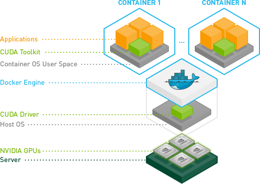

Run agentic system locally using docker on windows.

n8n Starter kit: [local n8n kit](https://github.com/n8n-io/self-hosted-ai-starter-kit)

=====

Download wsl2: [wsl](https://learn.microsoft.com/en-us/windows/wsl/install)
wsl.exe --install <by default ubutu distro will get install>

Download docker desktop and enable wsl: [docker wsl](https://docs.docker.com/desktop/features/wsl/)

Download nvidia driver: [nvidia cuda with wsl2](https://docs.nvidia.com/cuda/wsl-user-guide/index.html)

* not installed here, earlier cuda toolkit installed: [cuda toolkit](https://developer.nvidia.com/cuda-downloads).
download nvidia container toolkit: [nvidia container toolkit](https://docs.nvidia.com/datacenter/cloud-native/container-toolkit/latest/install-guide.html#installation)
? check if both is doing same thing

Test Docker with cuda: [docker cuda](https://docs.docker.com/desktop/features/gpu/)

Ollama Docker image with gpu: [ollma docker gpu](https://github.com/ollama/ollama/blob/main/docs/docker.md)
Confgiure container with cuda: [container cuda](https://docs.nvidia.com/datacenter/cloud-native/container-toolkit/latest/install-guide.html#configuration)

